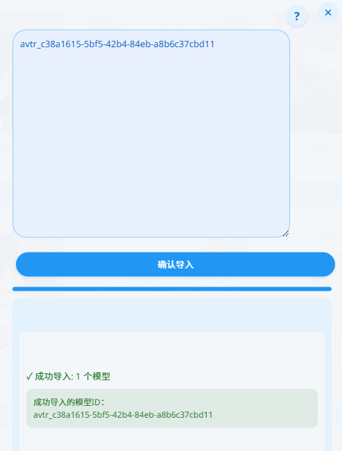

# VRChat アバターデータベースマネージャー

[English Documentation](README.md) | [中文文档](README-zh.md)

VRChatアバターを管理するためのTampermonkeyスクリプト。

<p align="center">
  <a href="https://github.com/gujimy/vrchat-avatar-db/releases/latest/download/vrchat_avatar_db.user.js">
    
  </a>
</p>

## 機能スクリーンショット


*画像 1: アバターデータベース管理メイン画面*



*画像 2: アバター詳細ページに追加された「DBに保存」ボタン*


*画像 3: アバターデータのインポート/エクスポート機能*

## 特徴

- アバターデータベース管理
- アバターデータのインポート/エクスポート（複数フォーマット対応）
- 検索と並べ替え機能
- 一括削除機能
- PC/Questプラットフォーム対応表示
- パフォーマンスランク表示
- ワンクリックでアバター切り替え
- アバター詳細ページから直接データベースに保存
- 多言語サポート（中国語、日本語、英語）
- VRChatインターフェースに合わせたカスタムUI

## 開発

### 必要環境

- Node.js >= 14
- npm >= 6

### 依存関係のインストール

```bash
npm install
```

### 開発モード

```bash
npm run dev
```

### 本番ビルド

```bash
npm run build
```

ビルドされたファイルは`dist`ディレクトリに生成されます。

## 使用方法

1. Tampermonkeyブラウザ拡張機能をインストール
2. 新しいスクリプトを作成
3. `dist/vrchat_avatar_db.user.js`の内容を新しいスクリプトにコピー
4. 保存して有効化
5. VRChatウェブサイトの左側ナビゲーションバーにある「Avatar DB」ボタンからアクセス
6. アバター詳細ページで「DBに保存」ボタンを使用して現在のアバターを直接保存

## ディレクトリ構造

```
.
├── src/
│   ├── components/    # UIコンポーネント
│   ├── services/      # データベースとAPIサービス
│   │   ├── database.js  # データベース操作
│   │   ├── i18n.js      # 国際化サービス
│   │   └── utils.js     # ユーティリティ関数
│   ├── styles/        # CSSスタイル
│   └── main.js        # エントリーポイント
├── dist/             # ビルド出力ディレクトリ
├── webpack.config.js  # webpack設定
└── package.json
```

## 国際化サポート

このスクリプトは以下の言語をサポートしています：

- 中国語
- 日本語
- 英語

システムはブラウザの言語を自動検出し、適切な表示言語を選択します。

## ライセンス

MIT 