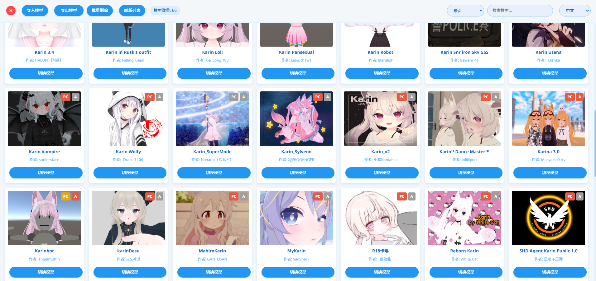
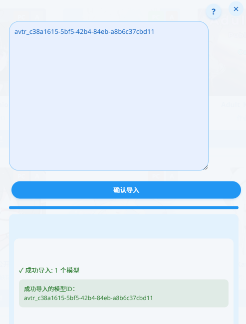
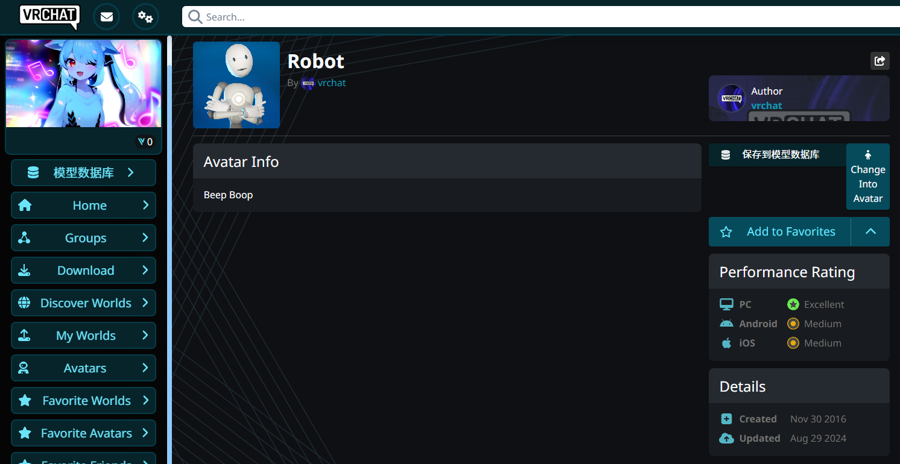

# VRChat Avatar Database Manager


[中文文档](README-zh.md) | [日本語ドキュメント](README-jp.md)

A Tampermonkey script for managing VRChat avatars.

<div align="center">
  <a href="https://github.com/gujimy/vrchat-avatar-db/releases/latest/download/vrchat_avatar_db.user.js">
    
  </a>
</div>

## Feature Screenshots



*Image 1: Avatar Database Management Main Interface*



*Image 2: "Save to DB" button added to the avatar details page*



*Image 3: Avatar Data Import and Export Functionality*

## Features

- Avatar database management
- Import/export avatar data (supports multiple formats)
- Search and sort functionality
- Batch delete feature
- PC/Quest platform support display
- Performance rating display
- One-click avatar switching
- Save avatars directly to database from avatar details page
- Multi-language support (Chinese, Japanese, English)
- Custom UI that matches VRChat interface style

## Development

### Requirements

- Node.js >= 14
- npm >= 6

### Install Dependencies

```bash
npm install
```

### Development Mode

```bash
npm run dev
```

### Production Build

```bash
npm run build
```

Built files will be generated in the `dist` directory.

## Usage

1. Install the Tampermonkey browser extension
2. Create a new script
3. Copy the contents of `dist/vrchat_avatar_db.user.js` into the new script
4. Save and enable the script
5. Access using the "Avatar DB" button in the left navigation bar on the VRChat website
6. Use the "Save to DB" button on avatar detail pages to save the current avatar directly

## Directory Structure

```
.
├── src/
│   ├── components/    # UI components
│   ├── services/      # Database and API services
│   │   ├── database.js  # Database operations
│   │   ├── i18n.js      # Internationalization service
│   │   └── utils.js     # Utility functions
│   ├── styles/        # CSS styles
│   └── main.js        # Entry point
├── dist/             # Build output directory
├── webpack.config.js  # webpack configuration
└── package.json
```

## Internationalization Support

This script supports the following languages:

- Chinese
- Japanese
- English

The system will automatically detect the browser language and select the appropriate display language.

## License

MIT